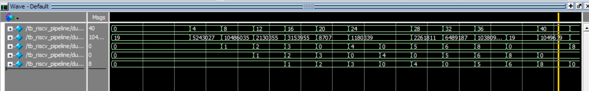
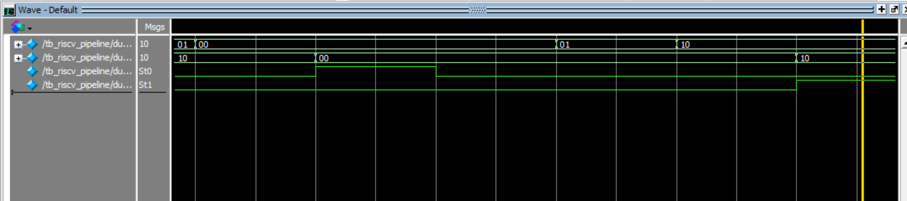
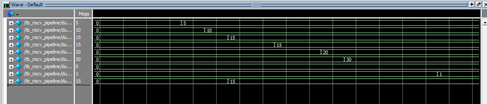

# 5-Stage Pipelined RISC-V Processor (Verilog)

##  Overview

This project implements a **simplified 5-stage pipelined RISC-V processor** in Verilog, demonstrating core concepts of modern CPU design including instruction pipelining, hazard detection, and data forwarding.

The processor executes a small program and is fully verified using simulation in ModelSim.

---

##  Architecture

The processor follows a standard 5-stage pipeline:

| Stage | Description |
|------|------------|
| IF | Instruction Fetch |
| ID | Instruction Decode |
| EX | Execute (ALU) |
| MEM | Data Memory Access |
| WB | Write Back |

---

##  Features

- 5-stage pipelined architecture
- Program Counter (PC)
- Register File (32 registers)
- ALU (arithmetic & logical operations)
- Instruction Memory
- Data Memory
- Control Unit
- Pipeline registers between stages
- Data hazard handling via **forwarding**
- Load-use hazard detection via **stalling**
- Basic branch handling (pipeline flush)

---

##  Hazard Handling

### Data Hazards
Handled using a **forwarding unit**:
- Forward from EX/MEM stage
- Forward from MEM/WB stage

### Load-Use Hazards
Handled using:
- **Stall insertion**
- Pipeline control logic

### Control Hazards
Handled using:
- **Pipeline flush on branch taken**

---

##  Simulation Results

###  Pipeline Execution


The waveform shows instructions progressing through the pipeline stages (IF → ID → EX → MEM → WB).

---

###  Hazard Handling & Forwarding


Forwarding signals (`forwardA`, `forwardB`) dynamically resolve data hazards by selecting data from later pipeline stages. Stall/branch signals indicate pipeline control behavior.

---

###  Final Register & Memory State


The final waveform confirms correct execution of the program.

| Register | Value |
|----------|------|
| x1 | 5 |
| x2 | 10 |
| x3 | 15 |
| x4 | 15 |
| x5 | 20 |
| x6 | 30 |
| x7 | 0 |
| x8 | 1 |
| mem[0] | 15 |

---

##  Test Program

The processor executes a small sequence of instructions including:
- arithmetic operations
- memory load/store
- dependent instructions (to test hazards)
- branch instruction

---

##  How to Run (ModelSim)

```tcl
vlib work
vmap work work

vlog rtl/*.v
vlog tb/tb_riscv_pipeline.v

vsim work.tb_riscv_pipeline
add wave -r *
run 300ns
